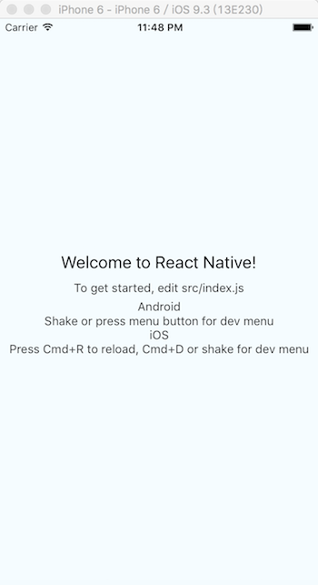

## 初始化方法

1. 切换到放项目目录

  ```
  // windows
  cd d:/xx/xxx/x
  // mac
  cd ~/Document/svn
  ```
2. 将代码拉到本地

  ```
  git clone https://git.coding.net/gllaj1988/casino-app.git
  ```
3. 切换到项目目录

  ```
  cd casino-app
  ```
4. 初始化项目

  ```
  npm install
  ```
5. 启动项目

  ```
  // android
  react-native run-android
  // iOS
  react-native run-ios
  ```
6. 哇哈哈

  
